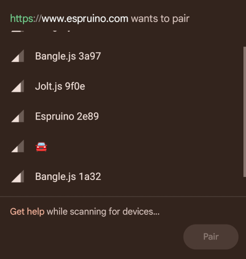

<!--- Copyright (c) 2024 Gordon Williams, Pur3 Ltd. See the file LICENSE for copying permission. -->
Bluetooth LE Emoji Advertising
===============================

<span style="color:red">:warning: **Please view the correctly rendered version of this page at https://www.espruino.com/BLE+Emoji. Links, lists, videos, search, and other features will not work correctly when viewed on GitHub** :warning:</span>

* KEYWORDS: Module,Modules,BLE,Bluetooth,Emoji,Smiley,Advertising,UTF8
* USES: BLE,Only BLE

Normally Espruino devices advertise themselves as the device name followed by
the last 4 digits of their MAC address, however that's easy to change with
`NRF.setAdvertising`:

```JS
NRF.setAdvertising({},{name:"Hello"});
```

However you're not just limited to normal ASCII text, because Bluetooth advertising
names are in [UTF8](https://en.wikipedia.org/wiki/UTF-8) which allows pretty much
any character type, including Emoji.

Not all Espruino devices natively support UTF8 (only Bangle.js at the moment), so
to reliably use Emoji we'd recommend that you include the raw UTF8 character codes.

So for instance if you'd like your Espruino device to advertise as a car 🚘, you
can use `NRF.setAdvertising({},{name:"\xF0\x9F\x9A\x98"});`



**NOTE:** The Web IDE recognises devices it can connect to in two ways: by their name,
and by the Nordic UART service they advertise as a scan response. If you change the name
then the IDE only has the service to work off, and in high Bluetooth traffic areas
or if you have disabled scan response with `scannable : false,`, the IDE will be
unable to find your device.

To work out what codes to use, you have two options:

## Use a website

Emoji and UTF8 codes are available at various different websites, but
this one in particular is a useful list, with the UTF8 codes in the correct
format:

https://apps.timwhitlock.info/emoji/tables/unicode


So if for instance you'd like to use a sunflower 🌻 search in that list for `sunflower`
and then copy the text under the `Bytes (UTF-8)` column: `\xF0\x9F\x8C\xBB`

```JS
NRF.setAdvertising({},{name:"\xF0\x9F\x8C\xBB"});
```

And now your Espruino will appear as a sunflower!

## Use a Web Browser / Node.js Console

Open the debug console in Chrome by hitting F12 (or choosing it from a menu).

Paste in the following - replace the dog emoji with what you want:

```JS
console.log(Array.from(new TextEncoder().encode("🐕")).map(z=>"\\x"+z.toString(16).padStart(2,0)).join(""))
```

And you should see something like `\xf0\x9f\x90\x95` printed to the console, which you can then
copy and paste into Espruino!